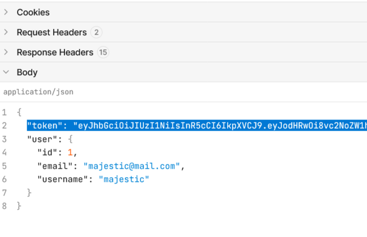
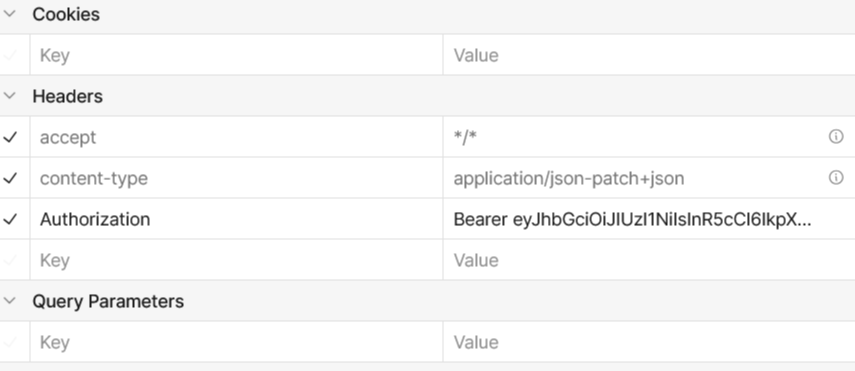
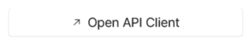
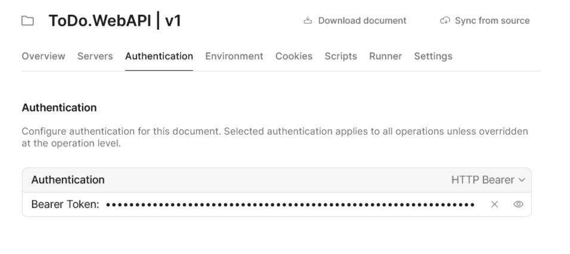
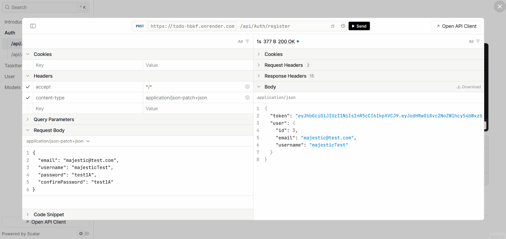

## Licenza
Distributed under the MIT License. See the [LICENSE](LICENSE) file for more information.
  
## Lo scopo di questo progetto
API REST per la gestione delle proprie attività. Ho scelto un progetto volutamente semplice per potermi esercitare per la prima volta sui principi di Clean Architecture e Domain-Driven Design, concentrandomi sull’organizzazione a layer, sulla separazione delle responsabilità e sulle best practice

### Live demo --> [https://todo-hbkf.onrender.com/scalar](https://todo-hbkf.onrender.com/scalar)
*NOTA: Il primo caricamento può essere lento (cold start del piano gratuito)

#### oppure testa in locale
    ```bash
    git clone https://github.com/diegoferrari129/ToDo.git
    cd ToDo
    dotnet run --project src/ToDo.WebAPI
    ```
    Apri `http://localhost:8080/scalar`
                
## N.B.
L'API utilizza JSON Web Token per l'autenticazione. Il flusso è:
1. Registrazione: `POST /api/auth/register`
2. Login: `POST /api/auth/login` --> ricevi un token
4. Testa le API protette --> **Ricordati di includere il token nell'header `Authorization: Bearer il-tuo-token`**
<table>
  <tr>
    <td align="center">
      
      <br /><em>Copia il token</em>
    </td>
    <td align="center">
      
      <br /><em>In Headers Key: Authorization e in Value: Bearer il-tuo-token</em>
    </td>
  </tr>
</table>

#### Puoi utilizzare il client per salvare il token e non doverlo inserire ad'ogni richiesta
<table>
  <tr>
    <td align="center">
      
      <br /><em>Vai al client</em>
    </td>
    <td align="center">
      
      <br /><em>Seleziona HTTP Bearer e incolla il token</em>
    </td>
  </tr>
</table>
<table>
  <tr>
    <td align="center">
      
    </td>
  </tr>
</table>
  
<table>
<tr>
  <td width="50%" valign="top">
  <h3>Architettura</h3>
    
  | Layer | Contenuto |
  |-------|-----------|
  | **ToDo.Domain** | Entity, Interfaces |
  | **ToDo.Application** | DTOs, Services (Business Logic) |
  | **ToDo.Infrastructure** | DbContext, Repositories, JWT, Password |
  | **ToDo.WebAPI** | Controllers, Middleware, Filters |

</td>
<td width="50%" valign="top">
<h3>Tech</h3>
    
<br>
<br>
<br>
<br>
<br>
<br>
<br>
<br>
<br>
<br>

</td>
</tr>
</table>
<p><em>SQL Server viene impiegato solo in sviluppo; SQLite gestisce il database in produzione su Render.</em></p>

## Prossimi sviluppi

- Refresh token
- Espandere l'app con Task collaborative e Admin tipo Trello
- Test unitari con xUnit
- Implementare MediatR + CQRS
- FluentValidation
- RabbitMQ o altri per notifiche

## Autore
[](https://github.com/diegoferrari129)
